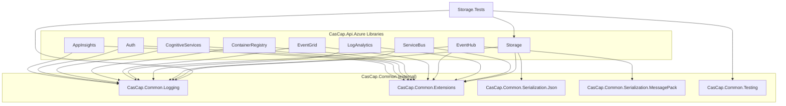
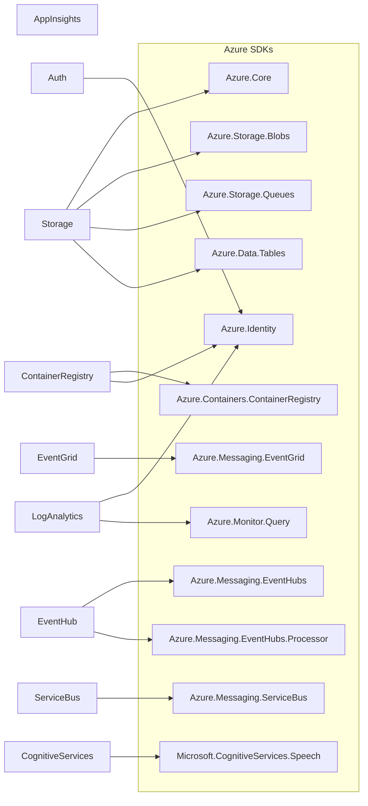
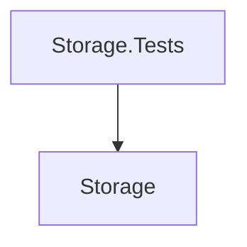

# CasCap.Api.Azure

[cascap.api.azure.appinsights-badge]: https://img.shields.io/nuget/v/CasCap.Api.Azure.AppInsights?color=blue
[cascap.api.azure.appinsights-url]: https://nuget.org/packages/CasCap.Api.Azure.AppInsights
[cascap.api.azure.auth-badge]: https://img.shields.io/nuget/v/CasCap.Api.Azure.Auth?color=blue
[cascap.api.azure.auth-url]: https://nuget.org/packages/CasCap.Api.Azure.Auth
[cascap.api.azure.cognitiveservices-badge]: https://img.shields.io/nuget/v/CasCap.Api.Azure.CognitiveServices?color=blue
[cascap.api.azure.cognitiveservices-url]: https://nuget.org/packages/CasCap.Api.Azure.CognitiveServices
[cascap.api.azure.containerregistry-badge]: https://img.shields.io/nuget/v/CasCap.Api.Azure.ContainerRegistry?color=blue
[cascap.api.azure.containerregistry-url]: https://nuget.org/packages/CasCap.Api.Azure.ContainerRegistry
[cascap.api.azure.eventgrid-badge]: https://img.shields.io/nuget/v/CasCap.Api.Azure.EventGrid?color=blue
[cascap.api.azure.eventgrid-url]: https://nuget.org/packages/CasCap.Api.Azure.EventGrid
[cascap.api.azure.eventhub-badge]: https://img.shields.io/nuget/v/CasCap.Api.Azure.EventHub?color=blue
[cascap.api.azure.eventhub-url]: https://nuget.org/packages/CasCap.Api.Azure.EventHub
[cascap.api.azure.loganalytics-badge]: https://img.shields.io/nuget/v/CasCap.Api.Azure.LogAnalytics?color=blue
[cascap.api.azure.loganalytics-url]: https://nuget.org/packages/CasCap.Api.Azure.LogAnalytics
[cascap.api.azure.servicebus-badge]: https://img.shields.io/nuget/v/CasCap.Api.Azure.ServiceBus?color=blue
[cascap.api.azure.servicebus-url]: https://nuget.org/packages/CasCap.Api.Azure.ServiceBus
[cascap.api.azure.storage-badge]: https://img.shields.io/nuget/v/CasCap.Api.Azure.Storage?color=blue
[cascap.api.azure.storage-url]: https://nuget.org/packages/CasCap.Api.Azure.Storage

A collection of .NET helper class libraries for interacting with Azure PaaS services. The repository contains 10 projects (9 libraries + 1 test project) targeting net8.0, net9.0, and net10.0.

| Library | Package |
| --- | --- |
| CasCap.Api.Azure.AppInsights | [![Nuget][cascap.api.azure.appinsights-badge]][cascap.api.azure.appinsights-url] |
| CasCap.Api.Azure.Auth | [![Nuget][cascap.api.azure.auth-badge]][cascap.api.azure.auth-url] |
| CasCap.Api.Azure.CognitiveServices | [![Nuget][cascap.api.azure.cognitiveservices-badge]][cascap.api.azure.cognitiveservices-url] |
| CasCap.Api.Azure.ContainerRegistry | [![Nuget][cascap.api.azure.containerregistry-badge]][cascap.api.azure.containerregistry-url] |
| CasCap.Api.Azure.EventGrid | [![Nuget][cascap.api.azure.eventgrid-badge]][cascap.api.azure.eventgrid-url] |
| CasCap.Api.Azure.EventHub | [![Nuget][cascap.api.azure.eventhub-badge]][cascap.api.azure.eventhub-url] |
| CasCap.Api.Azure.LogAnalytics | [![Nuget][cascap.api.azure.loganalytics-badge]][cascap.api.azure.loganalytics-url] |
| CasCap.Api.Azure.ServiceBus | [![Nuget][cascap.api.azure.servicebus-badge]][cascap.api.azure.servicebus-url] |
| CasCap.Api.Azure.Storage | [![Nuget][cascap.api.azure.storage-badge]][cascap.api.azure.storage-url] |

## Projects

| Project | Description | README |
| --- | --- | --- |
| **CasCap.Api.Azure.AppInsights** | Application Insights configuration & DI registration | [README](src/CasCap.Api.Azure.AppInsights/README.md) |
| **CasCap.Api.Azure.Auth** | Azure authentication credential factory for Key Vault and certificate-based access | [README](src/CasCap.Api.Azure.Auth/README.md) |
| **CasCap.Api.Azure.CognitiveServices** | Speech-to-text and text-to-speech via Azure Speech SDK | [README](src/CasCap.Api.Azure.CognitiveServices/README.md) |
| **CasCap.Api.Azure.ContainerRegistry** | Azure Container Registry repository/manifest listing | [README](src/CasCap.Api.Azure.ContainerRegistry/README.md) |
| **CasCap.Api.Azure.EventGrid** | Azure Event Grid messaging (placeholder) | [README](src/CasCap.Api.Azure.EventGrid/README.md) |
| **CasCap.Api.Azure.EventHub** | Event Hub publisher/subscriber with MessagePack serialization | [README](src/CasCap.Api.Azure.EventHub/README.md) |
| **CasCap.Api.Azure.LogAnalytics** | Log Analytics query service for Application Insights | [README](src/CasCap.Api.Azure.LogAnalytics/README.md) |
| **CasCap.Api.Azure.ServiceBus** | Service Bus queue and topic send/receive operations | [README](src/CasCap.Api.Azure.ServiceBus/README.md) |
| **CasCap.Api.Azure.Storage** | Blob, Queue, and Table storage base services | [README](src/CasCap.Api.Azure.Storage/README.md) |
| **CasCap.Api.Azure.Storage.Tests** | xUnit integration tests for Storage (requires Azurite) | [README](src/CasCap.Api.Azure.Storage.Tests/README.md) |

## Dependency Graph

### NuGet Package Dependencies



### Azure SDK Dependencies



### Project Reference Graph



## Project Structure

```text
/
├── .github/
│   ├── workflows/
│   │   └── ci.yml              # Main CI pipeline (lint, version, build)
│   └── dependabot.yml          # Auto-updates for nuget, github-actions, devcontainers
├── src/
│   ├── CasCap.Api.Azure.AppInsights/          # Application Insights helpers
│   ├── CasCap.Api.Azure.Auth/                 # Azure authentication credential factory
│   ├── CasCap.Api.Azure.CognitiveServices/    # Cognitive Services (e.g., Speech)
│   ├── CasCap.Api.Azure.ContainerRegistry/    # Azure Container Registry client
│   ├── CasCap.Api.Azure.EventGrid/            # Event Grid messaging
│   ├── CasCap.Api.Azure.EventHub/             # Event Hub streaming
│   ├── CasCap.Api.Azure.LogAnalytics/         # Log Analytics query service
│   ├── CasCap.Api.Azure.ServiceBus/           # Service Bus messaging
│   ├── CasCap.Api.Azure.Storage/              # Blob, Queue, Table storage
│   └── CasCap.Api.Azure.Storage.Tests/        # xUnit tests for Storage
├── Directory.Build.props       # Common MSBuild properties for all projects
├── Directory.Packages.props    # Centralized package version management (CPM)
├── .editorconfig               # Code style rules (4-space indent, LF line endings)
├── GitVersion.yml              # Semantic versioning configuration
├── global.json                 # .NET SDK version (allowPrerelease: false)
└── docker-compose.yml          # Azurite storage emulator setup
```

**Typical Project Structure:**

- `Abstractions/` - Interfaces
- `Services/` - Service implementations
- `Extensions/` - Dependency injection extensions
- `Models/` - DTOs and options classes
- `Usings.cs` - Global using statements

## Prerequisites

- **.NET SDK**: 10.0.x stable (see `global.json` — `allowPrerelease: false`)
- **Docker**: Required for Azurite storage emulator during testing

## Build and Test

### 1. Restore Dependencies (REQUIRED FIRST STEP)

```bash
dotnet restore CasCap.Api.Azure.Release.slnx
```

### 2. Build the Solution

```bash
dotnet build CasCap.Api.Azure.Release.slnx --configuration Release --no-restore
```

Builds all 10 projects for net8.0, net9.0, and net10.0 (30 DLLs total).

### 3. Clean Build Artifacts

```bash
dotnet clean CasCap.Api.Azure.Release.slnx
```

**Alternative:** PowerShell script `./clean.ps1` (removes all bin/obj folders recursively)

### 4. Format Code (REQUIRED BEFORE COMMIT)

```bash
dotnet format CasCap.Api.Azure.Release.slnx --no-restore
```

**Verify formatting:**

```bash
dotnet format CasCap.Api.Azure.Release.slnx --verify-no-changes --no-restore
```

CI will fail if code is not properly formatted.

### 5. Run Tests (REQUIRES AZURITE)

**Start Azurite storage emulator FIRST:**

```bash
docker compose up -d
```

**Ports:** 10000 (blob), 10001 (queue), 10002 (table)

**Run tests:**

```bash
dotnet test CasCap.Api.Azure.Release.slnx --configuration Release --no-build --verbosity normal
```

**Stop Azurite after testing:**

```bash
docker compose down
```

> **KNOWN ISSUE:** Tests currently fail with "API version 2026-02-06 is not supported by Azurite" errors. This is a known compatibility issue documented in `.github/workflows/ci.yml` (`execute-tests: false`). The CI explicitly skips tests.

### Quick Reference

**Full build from scratch:**

```bash
dotnet restore CasCap.Api.Azure.Release.slnx
dotnet build CasCap.Api.Azure.Release.slnx --configuration Release --no-restore
dotnet format CasCap.Api.Azure.Release.slnx --no-restore
```

**Build + Test (with Azurite):**

```bash
docker compose up -d
dotnet restore CasCap.Api.Azure.Release.slnx
dotnet build CasCap.Api.Azure.Release.slnx --configuration Release --no-restore
dotnet test CasCap.Api.Azure.Release.slnx --configuration Release --no-build
docker compose down
```

**Clean + Rebuild:**

```bash
dotnet clean CasCap.Api.Azure.Release.slnx
dotnet restore CasCap.Api.Azure.Release.slnx
dotnet build CasCap.Api.Azure.Release.slnx --configuration Release --no-restore
```

## Project Configuration

### Solution Files

| File | Purpose |
| --- | --- |
| `CasCap.Api.Azure.Debug.slnx` | Development — references local `CasCap.Common` repo |
| `CasCap.Api.Azure.Release.slnx` | Release builds — consumes `CasCap.Common` as NuGet packages |

**Dependency:** Debug builds require [CasCap.Common](https://github.com/f2calv/CasCap.Common) cloned at the same directory level.

### Key Files

| File | Purpose |
| --- | --- |
| `Directory.Build.props` | C# 14.0, `ImplicitUsings`, `Nullable: enable`, `TreatWarningsAsErrors: true`, `IsPackable: false` by default |
| `Directory.Packages.props` | Central package version management (`ManagePackageVersionsCentrally: true`) |
| `.editorconfig` | Code style rules (4-space indent, LF line endings, full formatting rules) |
| `global.json` | SDK constraint — stable releases only |
| `docker-compose.yml` | Azurite storage emulator setup |
| `GitVersion.yml` | Semantic versioning configuration |

### Suppressed Warnings

Configured in `Directory.Build.props`: `IDE1006`, `IDE0079`, `IDE0042`, `CS0162`, `CS1574`, `S125`, `NETSDK1233`, `NU1901`, `NU1902`, `NU1903`

## CI/CD Pipeline (.github/workflows/ci.yml)

**Triggers:** push (except preview branches), pull_request to main, workflow_dispatch

**Jobs:**

1. **lint** - Uses reusable workflow `f2calv/gha-workflows/.github/workflows/lint.yml@v1`
2. **versioning** - GitVersion for semantic versioning (uses GitVersion.yml)
3. **build** - Ubuntu runner with:
   - Azurite service container (ports 10000-10002)
   - Reusable workflow `f2calv/gha-dotnet-nuget@v2`
   - Configuration: Release (default) or Debug (manual)
   - **Tests are disabled** (`execute-tests: false`) due to Azurite API version incompatibility
4. **release** - Creates GitHub releases (only on main or preview branches)

## Multi-Targeting Notes

All libraries target **net8.0, net9.0, and net10.0** simultaneously. When making changes:

- Test builds across all target frameworks
- Some packages (like `System.Linq.Async`) are only referenced for net8.0/net9.0
- Build output generates separate DLLs for each framework

## Packaging & Versioning

- **IsPackable:** Explicitly set per project (default is `false` in Directory.Build.props)
- **Versioning:** Automated via GitVersion (MainLine mode)
- **NuGet Push:** Handled by CI on main branch (requires NUGET_API_KEY secret)
- **Package metadata:** Defined in Directory.Build.props (author, license, icon, source link)

## Making Changes

### Adding Code

1. Place code in the correct project by functionality
2. Follow `.editorconfig` style rules
3. Add XML documentation to all public API surface
4. Add tests in the corresponding `.Tests` project
5. Validate: `dotnet build CasCap.Api.Azure.Release.slnx --configuration Release --no-restore` → 0 errors

### Adding Dependencies

1. Add version to `Directory.Packages.props`
2. Reference in `.csproj` **without** a version attribute:

   ```xml
   <PackageReference Include="PackageName" />
   ```

3. Run `dotnet restore`

### Creating New Projects

- Library projects inherit `Directory.Build.props` automatically
- Set `<IsPackable>true</IsPackable>` explicitly only for NuGet packages
- Test projects must **not** be packable (default) and must target `net8.0;net9.0;net10.0`

## Validation Checklist

- [ ] `dotnet restore CasCap.Api.Azure.Release.slnx` succeeds
- [ ] `dotnet build CasCap.Api.Azure.Release.slnx --configuration Release --no-restore` completes with 0 errors
- [ ] `dotnet format CasCap.Api.Azure.Release.slnx --verify-no-changes --no-restore` passes
- [ ] Docker dependencies running for tests (`docker compose up -d`)
- [ ] Public API has XML documentation
- [ ] Properties separated by blank lines
- [ ] `ServiceProvider` instances are disposed in tests

## Contributing

1. Fork the repository and create a feature branch
2. Follow all conventions documented above
3. Run the full validation checklist before submitting a PR
4. PRs target the `main` branch and require CI to pass
5. Versioning is automated via GitVersion — do not manually edit version numbers

## Common Gotchas

1. **Debug vs Release solution:**
   - Debug solution references local `../CasCap.Common` repo (must be cloned)
   - Release solution uses NuGet packages
   - Always use Release solution unless actively developing CasCap.Common integration

2. **Central Package Management:**
   - Package versions are centralized in `Directory.Packages.props`
   - Never add version attributes to `<PackageReference>` in .csproj files
   - Update versions only in Directory.Packages.props

3. **Azurite Test Failures:**
   - Tests fail with API version errors - this is EXPECTED
   - Don't spend time trying to fix this unless specifically tasked
   - CI intentionally skips tests

4. **Docker Compose Command:**
   - Use `docker compose` (not `docker-compose`)
   - Older hyphenated command may not be available

5. **Formatting is Mandatory:**
   - CI will fail if code is not formatted
   - Always run `dotnet format` before committing
   - CI uses `--verify-no-changes` flag

6. **Pre-commit Hooks:**
   - Configured in `.pre-commit-config.yaml` but requires manual installation
   - Not automatically enforced in standard environments
   - Checks: YAML, JSON5, markdown linting, large files, whitespace
