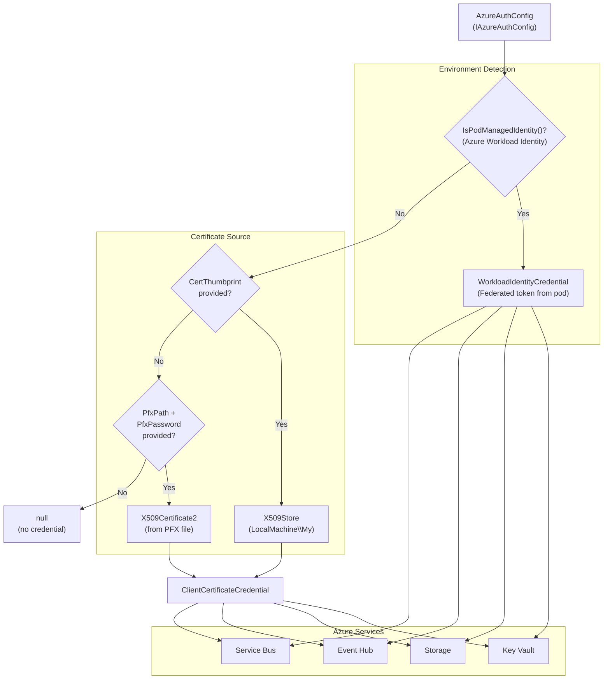

# CasCap.Api.Azure.Auth

Helper library for Azure authentication. Provides a factory for creating `TokenCredential` instances from certificate-based configuration properties and an abstraction for Azure Key Vault and Entra ID settings.

**Target frameworks:** `net8.0`, `net9.0`, `net10.0`

## Services / Extensions

| Type | Name | Description |
| --- | --- | --- |
| Interface | `IAzureAuthConfig` | Exposes Azure authentication configuration: Key Vault name/URI, Entra ID tenant/application IDs, certificate thumbprint or PFX path/password, and a lazily-resolved `TokenCredential`. |
| Static factory | `TokenCredentialExtensions` | Creates `ClientCertificateCredential` from `IAzureAuthConfig` properties (certificate thumbprint or PFX file). |

### Key Methods

- `TokenCredentialExtensions.IsPodManagedIdentity` — Checks whether the current pod is using Azure workload identity (federated tokens).
- `TokenCredentialExtensions.CreateTokenCredential(IAzureAuthConfig)` — Creates a `ClientCertificateCredential` from the certificate properties in the configuration, or returns `null` if no certificate is available.

## Configuration

| Class | Section | Properties |
| --- | --- | --- |
| `AzureAuthConfig` | `AppConfig` | `KeyVaultName` (required), `AzureEntraPodManagedIdentityClientId`, `AzureEntraTenantId`, `AzureEntraApplicationId`, `AzureEntraCertThumbprint`, `AzureEntraPfxPath`, `AzureEntraPfxPassword` |

`AzureAuthConfig` implements both `IAppConfig` and `IAzureAuthConfig`. The `TokenCredential` property is lazily created from the certificate properties via `TokenCredentialExtensions`.

## Data Flow

TokenCredential creation from configuration:

**Credential Resolution Priority:**

1. **Azure Workload Identity** (Kubernetes pod with federated token) — auto-detected
2. **Certificate thumbprint** — searches `LocalMachine\My` certificate store
3. **PFX file** — loads certificate from path with password
4. **null** — no credential available

## Dependencies

### NuGet Packages

| Package |
| --- |
| [Azure.Identity](https://www.nuget.org/packages/azure.identity) |
| [CasCap.Common.Abstractions](https://www.nuget.org/packages/cascap.common.abstractions) |
| [CasCap.Common.Extensions](https://www.nuget.org/packages/cascap.common.extensions) |
| [CasCap.Common.Logging](https://www.nuget.org/packages/cascap.common.logging) |

### Project References

None.
