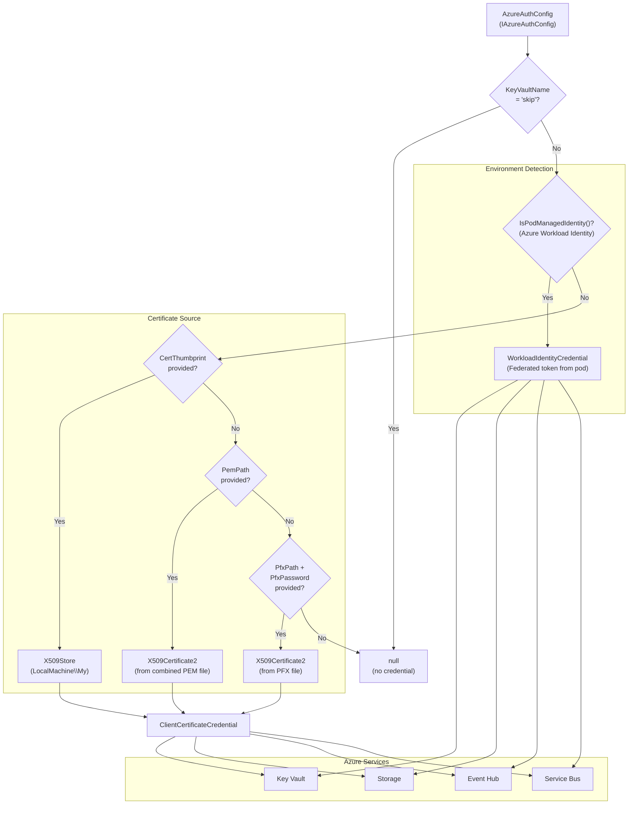

# CasCap.Api.Azure.Auth

Helper library for Azure authentication. Provides a factory for creating `TokenCredential` instances from certificate-based configuration properties and an abstraction for Azure Key Vault and Entra ID settings.

## Installation

```bash
dotnet add package CasCap.Api.Azure.Auth
```

**Target frameworks:** `net8.0`, `net9.0`, `net10.0`

## Services / Extensions

| Type | Name | Description |
| --- | --- | --- |
| Interface | `IAzureAuthConfig` | Exposes Azure authentication configuration: Key Vault name/URI, Entra ID tenant/application IDs, certificate thumbprint, combined PEM path, or PFX path/password, and a lazily-resolved `TokenCredential`. Provides `IsKeyVaultEnabled` to allow Key Vault-free operation. |
| Static factory | `TokenCredentialExtensions` | Creates `ClientCertificateCredential` from one configured certificate source: certificate thumbprint, combined PEM file, or PFX file. |

### Key Methods

- `TokenCredentialExtensions.IsPodManagedIdentity` — Checks whether the current pod is using Azure workload identity (federated tokens).
- `TokenCredentialExtensions.CreateTokenCredential(IAzureAuthConfig)` — Creates a `ClientCertificateCredential` from the certificate properties in the configuration, or returns `null` if no certificate is available.

## Configuration

| Class | Section | Properties |
| --- | --- | --- |
| `AzureAuthConfig` | `AppConfig` | `KeyVaultName` (required), `IsKeyVaultEnabled` (computed), `AzureEntraPodManagedIdentityClientId`, `AzureEntraTenantId`, `AzureEntraApplicationId`, `AzureEntraCertThumbprint`, `AzureEntraPemPath`, `AzureEntraPfxPath`, `AzureEntraPfxPassword` |

`AzureAuthConfig` implements both `IAppConfig` and `IAzureAuthConfig`. The `TokenCredential` property is lazily created from the certificate properties via `TokenCredentialExtensions`.

Configure exactly one certificate source. Supplying more than one fails explicitly rather than
silently selecting one:

- `AzureEntraCertThumbprint` selects a certificate from the current user's certificate store.
- `AzureEntraPemPath` loads one combined PEM file containing the certificate and private key. This
  is the preferred format when the same credential is also consumed by External Secrets Operator.
- `AzureEntraPfxPath` loads a PKCS#12/PFX file, with `AzureEntraPfxPassword` when it is protected.

PEM and PFX are alternative representations, not files to deploy together.

### Running Without Key Vault

Set `KeyVaultName` to `"skip"` (case-insensitive) to disable Key Vault integration entirely. When `IsKeyVaultEnabled` returns `false`:

- The application skips adding Azure Key Vault as a configuration source at startup.
- `TokenCredential` is not resolved (no certificate lookup is attempted).
- Secrets must be supplied via alternative configuration sources (environment variables, user secrets, or `appsettings.json`).
- Sink services that use `StorageExtensions.CreateTableClient()` automatically fall back to connection strings when the connection string contains `;` (e.g. Azurite emulator).

Override via any configuration source:

- **Environment variable**: `AppConfig__KeyVaultName=skip`
- **User secrets**: `{ "AppConfig": { "KeyVaultName": "skip" } }`
- **appsettings override**: same JSON shape

## Data Flow

TokenCredential creation from configuration:


```mermaid
flowchart TD
    CONFIG["AzureAuthConfig<br/>(IAzureAuthConfig)"]

    subgraph Detection["Environment Detection"]
        POD_CHECK{"IsPodManagedIdentity()?<br/>(Azure Workload Identity)"}
        WORKLOAD["WorkloadIdentityCredential<br/>(Federated token from pod)"]
    end

    subgraph CertificateSource["Certificate Source"]
        THUMBPRINT{"CertThumbprint<br/>provided?"}
        PEM{"PemPath<br/>provided?"}
        PFX{"PfxPath +<br/>PfxPassword<br/>provided?"}
        STORE["X509Store<br/>(LocalMachine\\My)"]
        PEM_FILE["X509Certificate2<br/>(from combined PEM file)"]
        FILE["X509Certificate2<br/>(from PFX file)"]
    end

    CREDENTIAL["ClientCertificateCredential"]
    NULL["null<br/>(no credential)"]

    subgraph AzureServices["Azure Services"]
        KV["Key Vault"]
        STORAGE["Storage"]
        EH["Event Hub"]
        SB["Service Bus"]
    end

    CONFIG --> SKIP_CHECK{"KeyVaultName<br/>= 'skip'?"}
    SKIP_CHECK -->|"Yes"| NULL
    SKIP_CHECK -->|"No"| POD_CHECK
    POD_CHECK -->|"Yes"| WORKLOAD
    POD_CHECK -->|"No"| THUMBPRINT

    THUMBPRINT -->|"Yes"| STORE
    THUMBPRINT -->|"No"| PEM

    PEM -->|"Yes"| PEM_FILE
    PEM -->|"No"| PFX
    PFX -->|"Yes"| FILE
    PFX -->|"No"| NULL

    STORE --> CREDENTIAL
    PEM_FILE --> CREDENTIAL
    FILE --> CREDENTIAL
    WORKLOAD --> KV
    WORKLOAD --> STORAGE
    WORKLOAD --> EH
    WORKLOAD --> SB

    CREDENTIAL --> KV
    CREDENTIAL --> STORAGE
    CREDENTIAL --> EH
    CREDENTIAL --> SB
```

**Credential Resolution Priority:**

0. **Skip sentinel** — `KeyVaultName = "skip"` → `null` (no credential, no Key Vault)
1. **Azure Workload Identity** (Kubernetes pod with federated token) — auto-detected
2. **Certificate thumbprint** — searches `LocalMachine\My` certificate store
3. **Combined PEM file** — loads the certificate and private key from one file
4. **PFX file** — loads certificate from path with optional password
5. **null** — no credential available

Certificate source configuration is mutually exclusive; the numbered list documents supported
sources, not fallback precedence between simultaneously configured values.

## Dependencies

### NuGet Packages

| Package |
| --- |
| [Azure.Identity](https://www.nuget.org/packages/azure.identity) |
| [CasCap.Common.Abstractions](https://www.nuget.org/packages/cascap.common.abstractions) |
| [CasCap.Common.Extensions](https://www.nuget.org/packages/cascap.common.extensions) |
| [CasCap.Common.Logging](https://www.nuget.org/packages/cascap.common.logging) |

### Project References

None.
