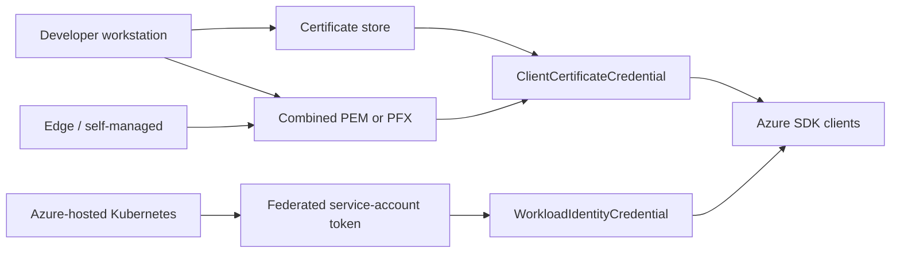

# CasCap.Api.Azure.Auth

Azure authentication helpers that give applications one configuration model and credential factory
across development, Edge, and Azure-hosted environments:

- **Developer workstations** can load a client certificate from the current user's certificate
  store, a combined PEM file, or a PFX file.
- **Edge and self-managed deployments** can mount one combined PEM or PFX client certificate without
  requiring Azure Arc, cluster membership in Entra ID, or a cloud-managed node identity.
- **Azure-hosted Kubernetes workloads** can use federated workload identity. The library detects the
  injected Azure environment and creates a `WorkloadIdentityCredential` without a certificate or
  client secret.
- **Local or disconnected environments** can disable Key Vault integration explicitly and use other
  configuration providers.

Every enabled path produces an Azure SDK `TokenCredential`, so the application can use the same
startup and dependency-injection flow for Key Vault, Storage, Event Hubs, Service Bus, and other
token-aware Azure clients.


```mermaid
flowchart LR
    DEV["Developer workstation"] --> STORE["Certificate store"]
    DEV --> FILE["Combined PEM or PFX"]
    EDGE["Edge / self-managed"] --> FILE
    AZURE["Azure-hosted Kubernetes"] --> FEDERATED["Federated service-account token"]

    STORE --> CLIENT_CERT["ClientCertificateCredential"]
    FILE --> CLIENT_CERT
    FEDERATED --> WORKLOAD["WorkloadIdentityCredential"]

    CLIENT_CERT --> SDK["Azure SDK clients"]
    WORKLOAD --> SDK
```

## Installation

```bash
dotnet add package CasCap.Api.Azure.Auth
```

**Target frameworks:** `net8.0`, `net9.0`, `net10.0`

## Services / Extensions

| Type | Name | Description |
| --- | --- | --- |
| Interface | `IAzureAuthConfig` | Exposes Azure authentication configuration: Key Vault name/URI, Entra ID tenant/application IDs, certificate thumbprint, combined PEM path, or PFX path/password, and a lazily-resolved `TokenCredential`. Provides `IsKeyVaultEnabled` to allow Key Vault-free operation. |
| Static factory | `TokenCredentialExtensions` | Creates `WorkloadIdentityCredential` from injected Kubernetes workload-identity environment variables, or `ClientCertificateCredential` from one configured certificate source. |

### Key Methods

- `TokenCredentialExtensions.IsPodManagedIdentity` — Checks whether the current pod is using Azure workload identity (federated tokens).
- `TokenCredentialExtensions.CreateTokenCredential(IAzureAuthConfig)` — Creates a `WorkloadIdentityCredential` when the Kubernetes workload-identity environment is present; otherwise creates a `ClientCertificateCredential` from the configured certificate source, or returns `null`.

## Configuration

| Class | Section | Properties |
| --- | --- | --- |
| `AzureAuthConfig` | `AppConfig` | `KeyVaultName` (required), `IsKeyVaultEnabled` (computed), `AzureEntraPodManagedIdentityClientId`, `AzureEntraTenantId`, `AzureEntraApplicationId`, `AzureEntraCertThumbprint`, `AzureEntraPemPath`, `AzureEntraPfxPath`, `AzureEntraPfxPassword` |

`AzureAuthConfig` implements both `IAppConfig` and `IAzureAuthConfig`. The `TokenCredential` property is lazily created from the certificate properties via `TokenCredentialExtensions`.

Azure workload identity is selected when `AZURE_CLIENT_ID`, `AZURE_TENANT_ID`,
`AZURE_FEDERATED_TOKEN_FILE`, and `AZURE_AUTHORITY_HOST` are all present. The injected
`AZURE_CLIENT_ID` is used by default; `AzureEntraPodManagedIdentityClientId` can explicitly select a
different registered client ID. Certificate configuration is ignored in this environment because
workload identity has priority.

Configure exactly one certificate source. Supplying more than one fails explicitly rather than
silently selecting one:

- `AzureEntraCertThumbprint` selects a certificate from the current user's certificate store.
- `AzureEntraPemPath` loads one combined PEM file containing the certificate and private key. This
  is the preferred format when the same credential is also consumed by External Secrets Operator.
- `AzureEntraPfxPath` loads a PKCS#12/PFX file, with `AzureEntraPfxPassword` when it is protected.

PEM and PFX are alternative representations, not files to deploy together.

### Developer Certificate Selection

For workstation development, install the certificate and private key into the current user's
Personal certificate store and keep `AzureEntraCertThumbprint` in the application's user-secrets
store. Each repository can have a different `UserSecretsId`, so rotating one shared certificate
requires updating every consuming repository's `secrets.json`.

Do not place workstation thumbprints or paths in tracked configuration. Also remove
deployment-only PEM/PFX path values from local providers loaded on the workstation: configuring a
thumbprint and a file path together fails explicitly instead of silently selecting one.

### Running Without Key Vault

Set `KeyVaultName` to `"skip"` (case-insensitive) to disable Key Vault integration entirely. When `IsKeyVaultEnabled` returns `false`:

- The application skips adding Azure Key Vault as a configuration source at startup.
- `TokenCredential` is not resolved (no certificate lookup is attempted).
- Secrets must be supplied via alternative configuration sources (environment variables, user secrets, or `appsettings.json`).
- Sink services that use `StorageExtensions.CreateTableClient()` automatically fall back to connection strings when the connection string contains `;` (e.g. Azurite emulator).

Override via any configuration source:

- **Environment variable**: `AppConfig__KeyVaultName=skip`
- **User secrets**: `{ "AppConfig": { "KeyVaultName": "skip" } }`
- **appsettings override**: same JSON shape

## Credential Resolution

**Credential Resolution Priority:**

0. **Skip sentinel** — `KeyVaultName = "skip"` → `null` (no credential, no Key Vault)
1. **Azure Workload Identity** (Kubernetes pod with federated token) — auto-detected
2. **Certificate thumbprint** — searches `LocalMachine\My` certificate store
3. **Combined PEM file** — loads the certificate and private key from one file
4. **PFX file** — loads certificate from path with optional password
5. **null** — no credential available

Certificate source configuration is mutually exclusive; the numbered list documents supported
sources, not fallback precedence between simultaneously configured values.

## Dependencies

### NuGet Packages

| Package |
| --- |
| [Azure.Identity](https://www.nuget.org/packages/azure.identity) |
| [CasCap.Common.Abstractions](https://www.nuget.org/packages/cascap.common.abstractions) |
| [CasCap.Common.Extensions](https://www.nuget.org/packages/cascap.common.extensions) |
| [CasCap.Common.Logging](https://www.nuget.org/packages/cascap.common.logging) |

### Project References

None.
