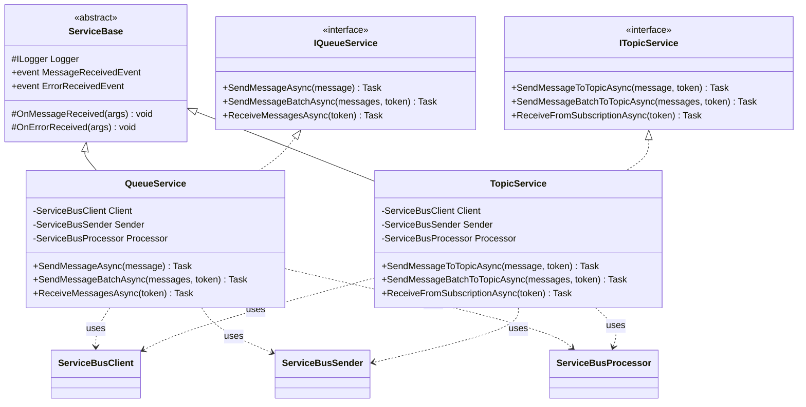

# CasCap.Api.Azure.ServiceBus

Helper library for Azure Service Bus. Provides base service classes for queue and topic send/receive operations with event-driven message handling.

## Services / Extensions

| Type | Name | Description |
| --- | --- | --- |
| Interface | `IQueueService` | Abstraction for Service Bus queue send and receive operations. |
| Interface | `ITopicService` | Abstraction for Service Bus topic send and receive operations. |
| Service | `ServiceBase` | Abstract base class providing common message and error event handling (`MessageReceivedEvent`, `ErrorReceivedEvent`). |
| Service | `QueueService` | Implements `IQueueService`. Sends single messages, batches, and receives from queues. Supports connection string and `TokenCredential` authentication. |
| Service | `TopicService` | Implements `ITopicService`. Sends single messages, batches, and receives from topics/subscriptions. Supports connection string and `TokenCredential` authentication. |

### Key Methods — `QueueService`

- `SendMessageAsync(ServiceBusMessage)` — Sends a single message to the queue.
- `SendMessageBatchAsync(Queue<ServiceBusMessage>, CancellationToken)` — Sends a batch of messages.
- `ReceiveMessagesAsync(CancellationToken)` — Receives and processes messages from the queue.

### Key Methods — `TopicService`

- `SendMessageToTopicAsync(ServiceBusMessage, CancellationToken)` — Sends a single message to the topic.
- `SendMessageBatchToTopicAsync(Queue<ServiceBusMessage>, CancellationToken)` — Sends a batch of messages.
- `ReceiveFromSubscriptionAsync(CancellationToken)` — Receives and processes messages from a subscription.

## Class Hierarchy

Queue and Topic service abstraction for Azure Service Bus:

**Usage Pattern:**

1. Instantiate `QueueService` for queue operations or `TopicService` for topic/subscription operations
2. Subscribe to `MessageReceivedEvent` for incoming messages
3. Subscribe to `ErrorReceivedEvent` for error handling
4. Use `SendMessageAsync` / `SendMessageBatchAsync` for sending
5. Use `ReceiveMessagesAsync` / `ReceiveFromSubscriptionAsync` to start listening

## Configuration

No configuration model. Services are constructed directly with connection strings or `TokenCredential`.

## Dependencies

### NuGet Packages

| Package |
| --- |
| [Azure.Messaging.ServiceBus](https://www.nuget.org/packages/azure.messaging.servicebus) |
| [CasCap.Common.Logging](https://www.nuget.org/packages/cascap.common.logging) |
| [CasCap.Common.Extensions](https://www.nuget.org/packages/cascap.common.extensions) |

### Project References

None.
