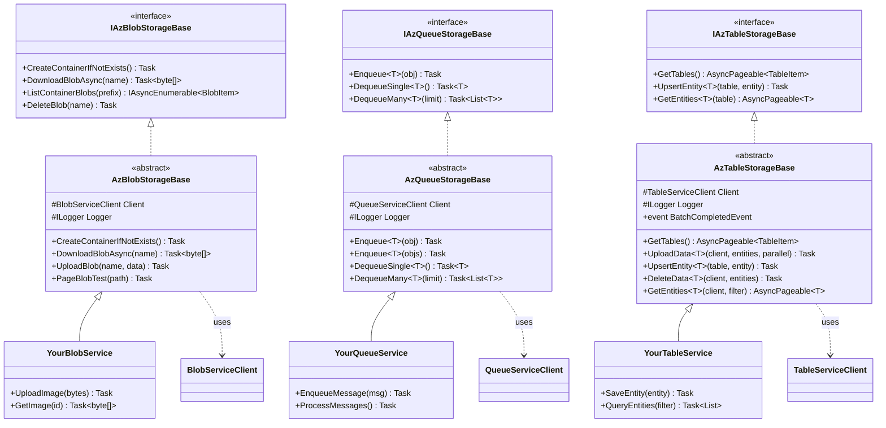

# CasCap.Api.Azure.Storage

Helper library for Azure Storage Services. Provides abstract base service classes for Blob, Queue, and Table storage operations with both connection string and `TokenCredential` authentication.

## Services / Extensions

| Type | Name | Description |
| --- | --- | --- |
| Interface | `IAzBlobStorageBase` | Contract for Azure Blob Storage container operations (upload, download, list, delete). |
| Interface | `IAzQueueStorageBase` | Contract for Azure Queue Storage operations (enqueue, dequeue). |
| Interface | `IAzTableStorageBase` | Contract for Azure Table Storage CRUD operations with batch support. |
| Service | `AzBlobStorageBase` | Abstract base implementing `IAzBlobStorageBase`. Supports block blobs, page blobs, and append blobs. |
| Service | `AzQueueStorageBase` | Abstract base implementing `IAzQueueStorageBase`. Handles Base64 message encoding and JSON serialization. |
| Service | `AzTableStorageBase` | Abstract base implementing `IAzTableStorageBase`. Supports batch upsert, delete, and query with parallel partition processing. |
| Extension | `LocalExtensions` | Extension methods for Table Storage key validation (`IsKeyValid`), `TableServiceClient.ExistsAsync`, and date-from-filename parsing. |
| Message | `AzTableStorageArgs` | Event args for `BatchCompletedEvent`, carrying batch metadata (table name, partition key, count, remaining). |

### Key Methods — `AzBlobStorageBase`

- `CreateContainerIfNotExists(CancellationToken)` — Creates the blob container if it does not exist.
- `DownloadBlobAsync(string blobName, CancellationToken)` — Downloads blob content as a byte array.
- `ListContainerBlobs(string? prefix, CancellationToken)` — Lists blobs in the container.
- `GetBlobPrefixes(string? prefix, CancellationToken)` — Retrieves virtual directory prefixes.
- `DeleteBlob(string blobName, CancellationToken)` — Deletes a blob.
- `PageBlobTest(string path, CancellationToken)` — Page blob creation and write test.

### Key Methods — `AzQueueStorageBase`

- `Enqueue<T>(T obj)` / `Enqueue<T>(List<T> objs)` — Serializes and enqueues messages.
- `DequeueSingle<T>()` — Dequeues and deserializes a single message.
- `DequeueMany<T>(int limit)` — Dequeues and deserializes multiple messages.

### Key Methods — `AzTableStorageBase`

- `GetTables(CancellationToken)` — Lists all tables in the storage account.
- `GetTableClient(string tableName, bool CreateIfNotExists, CancellationToken)` — Gets a `TableClient` for a table.
- `UploadData<T>(TableClient, List<T>, bool useParallelism, CancellationToken)` — Batch upsert entities.
- `UpsertEntity<T>(string tableName, T entity, CancellationToken)` — Upserts a single entity.
- `DeleteData<T>(TableClient, List<T>, CancellationToken)` — Batch delete entities.
- `GetEntities<T>(TableClient, ...)` — Queries entities with optional filtering and paging.

## Class Hierarchy

Abstract base classes for Azure Storage services:

**Usage Pattern:**

1. Inherit from appropriate abstract base class
2. Pass connection string or `TokenCredential` to base constructor
3. Use protected `Client` and `Logger` fields
4. Call base methods or add domain-specific operations

## Configuration

No configuration model. Services are constructed directly with connection strings or `TokenCredential`.

## Dependencies

### NuGet Packages

| Package |
| --- |
| [Azure.Core](https://www.nuget.org/packages/azure.core) |
| [Azure.Storage.Blobs](https://www.nuget.org/packages/azure.storage.blobs) |
| [Azure.Storage.Queues](https://www.nuget.org/packages/azure.storage.queues) |
| [Azure.Data.Tables](https://www.nuget.org/packages/azure.data.tables) |
| [System.Linq.Async](https://www.nuget.org/packages/system.linq.async) |
| [CasCap.Common.Logging](https://www.nuget.org/packages/cascap.common.logging) |
| [CasCap.Common.Extensions](https://www.nuget.org/packages/cascap.common.extensions) |
| [CasCap.Common.Serialization.Json](https://www.nuget.org/packages/cascap.common.serialization.json) |

### Project References

None.
